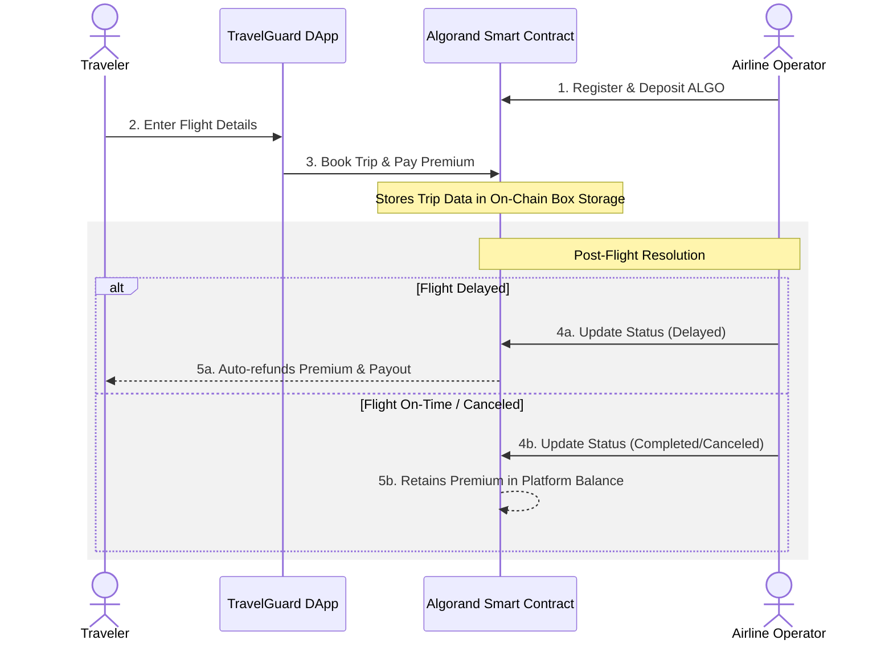

# TravelGuard ✈️🛡️

> Decentralized flight insurance powered by Algorand smart contracts. Automatic refunds when your flight is delayed — no middlemen, no paperwork.

**TravelGuard** is a dApp (Decentralized Application) built on the Algorand TestNet that connects travelers seeking flight insurance with airline operators managing flight statuses. 

With TravelGuard, your insurance policies are stored transparently on the blockchain. If your flight is delayed or canceled, the smart contract ensures you get compensated swiftly and reliably.

---

## ✨ Key Features

### For Travelers 👥
- **Book Trip Insurance**: Securely purchase protection for your upcoming flights through smart contracts.
- **Track Flight Status**: Monitor if your flight is on-time, delayed, or canceled directly from your personal dashboard.
- **Instant On-Chain Refunds**: Claim automatic payouts when your flight is marked as delayed without relying on tedious paperwork or claims adjusters.

### For Operators 💼
- **Register Airlines**: Easily onboard to the protocol as an operator and deposit ALGO to back your flights.
- **Manage Flight Status**: Update flight delays securely using blockchain transactions to ensure transparent passenger resolution.
- **Resolve Trips**: Efficiently complete or cancel trips while maintaining a clear, immutable history.

---

## 🔄 Application Workflow



---

## 🛠️ Technology Stack

- **Frontend Environment**: React 19, Vite, Tailwind CSS (v4), Framer Motion, Lucide Icons
- **Web3 / Blockchain**: Algorand SDK (`algosdk`), Pera Wallet Connect (`@perawallet/connect`)
- **Backend API**: Node.js, Express (used as a lightweight indexing & caching layer to read standard/box states from Algorand)

---

## 📁 Repository Structure

```text
TravelGuard/
├── Backend/                 # Node.js API acting as an indexing layer
│   ├── src/
│   │   ├── config.js        # Environment and Network Configurations
│   │   ├── services/algorand.js # Algorand smart-contract read/write interactions
│   │   ├── routes/          # Express API routes (Operators, Platforms, Trips)
│   │   └── contract/        # Smart contract ABI artifacts (.arc32.json)
│   ├── package.json
│   └── server.js            # Backend entry point
│
└── Frontend/                # Vite React Application
    ├── src/
    │   ├── components/      # Key UI components (BookTripTab, OperatorDashboardTab)
    │   ├── hooks/           # Custom React hooks (e.g., useWallet)
    │   ├── services/        # Frontend API abstractions
    │   └── App.tsx          # Main Web Interface
    ├── index.html
    └── package.json
```

---

## 🚀 Getting Started

### Prerequisites
- [Node.js](https://nodejs.org/) (v22 or newer recommended)
- A compatible Algorand Wallet (e.g., [Pera Wallet](https://perawallet.app/)) connected to the **Algorand TestNet**.
- ALGO faucets to fund your testnet transactions.

### 1. Setup the Backend Server
The backend connects directly to Algorand TestNet nodes to provide quick query data to the frontend UI without fully syncing via nodes.

```bash
cd Backend

# Install dependencies
npm install

# Start the development server (Defaults to http://localhost:4000)
npm run dev
```

> **Note**: The backend expects an `APP_ID`. Check `Backend/src/config.js` or define `.env` manually if using a custom deployment.

### 2. Setup the Frontend Application
The frontend is a highly interactive, responsive application built with React and Vite.

```bash
cd Frontend

# Install dependencies
npm install
```

Configure environment logic by adding a `.env` in the `Frontend/` folder:
```env
VITE_BACKEND_URL=http://localhost:4000
VITE_APP_ID=756737231
VITE_ALGOD_SERVER=https://testnet-api.algonode.cloud
VITE_ALGOD_PORT=443
```

Start the Vite application:
```bash
npm run dev
```

### 3. Usage
- Navigate to `http://localhost:3000` (or the local network URL provided by Vite).
- Select "Connect Wallet" and scan/approve the connection via your Pera Wallet on TestNet.
- Choose your role (**Traveler** or **Operator**) to enter the appropriate dashboard.

---

## 💡 How It Works Under The Hood
TravelGuard utilizes advanced Algorand Smart Contract features:
- **Global State**: Tracking platform variables (Total Trips, Platform ALGO balance) uniformly across application usage.
- **Box Storage**: Providing optimized, large-scale maps for Airline Operators and Trip states efficiently without ballooning local state costs.
- **Atomic Transfers**: Transactions for insurance premium deposits and refunds are handled seamlessly in chained app calls.

---

## 📄 License
This project is open-source and securely available under the ISC License.
